# ToolGen Design

## Aim

The assessment asks for an offline synthetic data generator for multi-turn,
multi-tool, multi-step conversations grounded in ToolBench schemas. I interpreted the
hard problem as trustworthy data generation: every record should say which tool was
called, why it was valid, what fake output came back, whether later calls used earlier
outputs, and how the result scored.

The central analogy is a simulator. Real APIs are the real world; ToolGen is the
training arena where agents can practice without spending money, leaking data, or
mutating production systems.

## Requirement Coverage

| Requirement | Status | Implementation |
| --- | --- | --- |
| Parse ToolBench-style API JSON | Covered | `registry.loader`, `models.py` |
| Build a tool graph | Covered | `graph.builder` |
| Constrained graph sampler | Covered | `graph.sampler` |
| Multi-agent generation | Covered | planner, user simulator, assistant, orchestrator |
| Offline tool execution | Covered | `executor.mock_executor` |
| Within-conversation grounding | Covered | session state and ID reuse |
| Cross-conversation diversity | Covered with caveat | counter steering, optional mem0 |
| LLM-as-judge | Covered | live judge plus heuristic fallback |
| Repair loop | Covered | structural repair and regeneration retry |
| 100-sample reproducible run | Covered offline | tested through pipeline |
| Pure live 100-sample run | Implemented, quota dependent | `TOOLGEN_REQUIRE_LIVE_LLM=true` |
| Parallel tool calls in one turn | Not implemented | future work |

## Architecture Overview

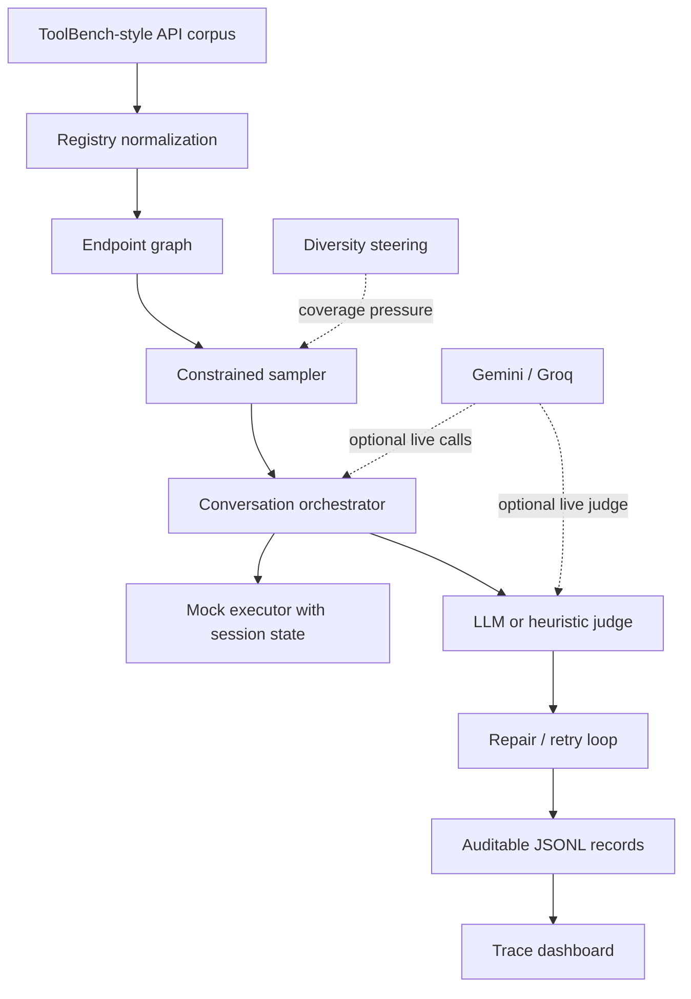

The important boundary is that the sampled tool path controls generation. The LLM can
write natural language and choose arguments, but it does not get unrestricted access to
the whole registry.

## Core Data Model

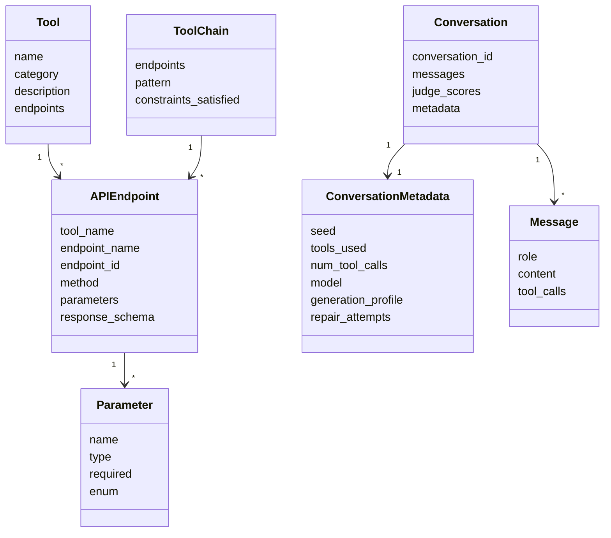

## Data Flow

```mermaid
flowchart LR
    Raw["Raw tool JSON"] --> Clean["Typed ToolRegistry"]
    Clean --> Edges["Heuristic endpoint edges"]
    Edges --> Graph["Weighted DiGraph"]
    Graph --> Chain["Sampled ToolChain"]
    Chain --> Plan["ScenarioPlan"]
    Plan --> Chat["Conversation state machine"]
    Chat --> Calls["Assistant tool calls"]
    Calls --> Mock["Mock tool outputs"]
    Mock --> Grounding["Grounded follow-up calls"]
    Grounding --> Scores["Judge scores"]
    Scores --> Final["Final JSONL output"]
```

The graph chooses a plausible path. The planner turns that path into a scenario. The
orchestrator keeps the conversation on track. The executor creates fake API responses
and remembers IDs so later calls can use them. The judge scores the final trace.

## Key Design Decisions

### Typed Registry Instead Of Raw JSON

ToolBench-style data is useful but messy: parameters may be lists or dictionaries,
types may be missing, and endpoint names can collide. ToolGen normalizes this into
Pydantic models before generation.

Selected:

- Pydantic models for `Tool`, `APIEndpoint`, and `Parameter`
- stable endpoint ids of the form `tool_name/endpoint_name`
- conservative fallback to `unknown` parameter type when needed

Not selected:

- a database, because file-based local reproducibility is enough here
- dropping malformed endpoints aggressively, because that would reduce coverage
- a formal ontology, because the assessment needs generation and evaluation first

Registry normalization:

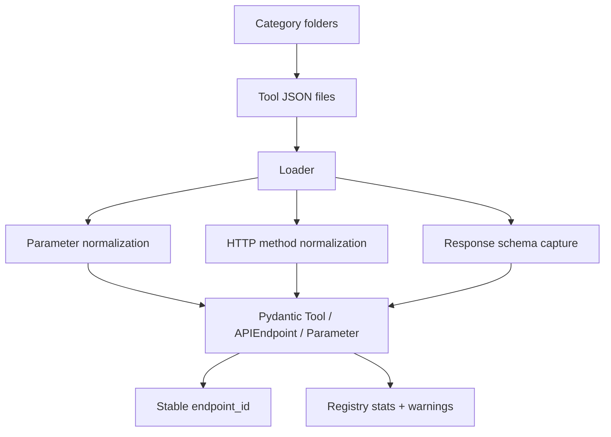

### Heuristic Tool Graph Instead Of A Black-Box Graph

The graph is a directed `networkx.DiGraph` over endpoints. Edges represent:

- `io_chain`: likely output-to-input dependency
- `complementary`: useful verb order such as search -> get -> book
- `same_tool`: endpoints from one tool
- `same_category`: fallback relation across similar tools

Selected:

- deterministic heuristics that can be inspected and tested
- weighted random walks for variety
- caps on dense same-category fallback edges

Not selected:

- Neo4j, because it adds infrastructure without changing the core algorithm
- LLM-generated graph edges, because they are expensive and harder to reproduce
- embedding-only edges, because they are useful later but not necessary for a baseline

Graph edge taxonomy:

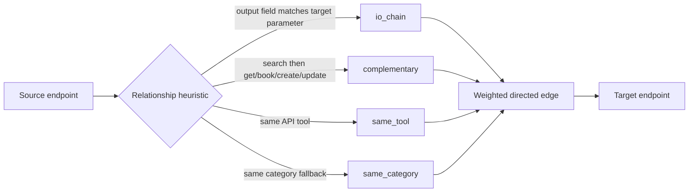

Sampler control flow:

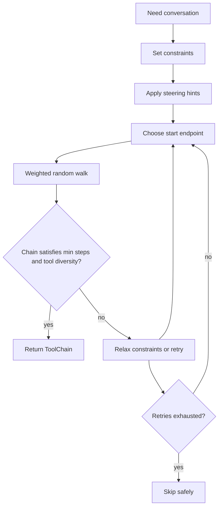

### Bounded Multi-Agent System

The generator is multi-agent, but not an unconstrained autonomous agent.

Roles:

- planner: produces a structured `ScenarioPlan`
- user simulator: asks and answers like a realistic user
- assistant: asks clarifying questions or emits tool calls
- executor: returns fake tool outputs
- judge: scores the completed trace
- repairer: fixes structural or low-quality examples

This division keeps creativity bounded by the sampled graph. The assistant sees only
the relevant chain tools, not the entire registry, which reduces invalid calls.

Generation sequence:

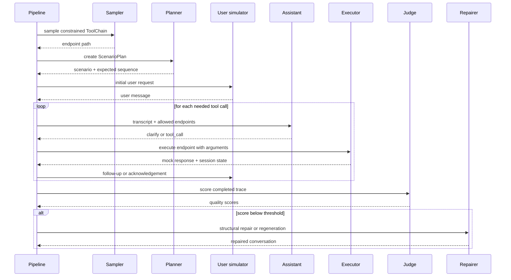

### Mock Executor With Session State

The mock executor does not call real APIs. It infers operation type from endpoint names
such as search, get, create, update, delete, book, or cancel. It returns fake outputs
with stable IDs. If search returns `hotel_123`, later calls can use `hotel_123`.

Selected:

- deterministic fake outputs for reproducibility
- session-local state for grounding
- schema-aware argument handling where possible

Not selected:

- real API calls, because the assessment asks for offline generation
- full API simulation, because auth, pagination, rate limits, and side effects would
  need domain-specific adapters

Session grounding:

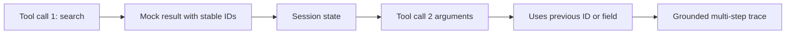

### Live LLM Routing With Strict Mode

The system supports four useful modes:

- `offline`: deterministic generator and heuristic judge
- `auto`: use Gemini/Groq when keys exist, otherwise fall back
- `full` live profile: planner, user simulator, assistant decisions, assistant
  summaries, and judge are live
- `hybrid` live profile: planner, assistant tool decisions, and judge are live;
  user turns and tool-result summaries are deterministic to reduce quota usage
- strict live: fail instead of falling back when `TOOLGEN_REQUIRE_LIVE_LLM=true`

Model pools are configurable and randomized per request. This helps use multiple model
classes without tying the code to one provider. Smaller fast models are reasonable for
judging and simple user turns; stronger models are better for scenario planning and
assistant behavior when quota allows.

The `hybrid` profile is the quota-conscious option. It still asks the assistant to make
step-by-step tool decisions after seeing context, but removes the least valuable live
calls: user-simulator follow-ups and assistant summaries after every tool result.

The Groq `llama-3.1-8b-instant` class is attractive for cost and request limits, but it
is best used for judging, repair checks, or lightweight turns. For richer generation,
a stronger model is safer when quota is available.

Model and config routing:

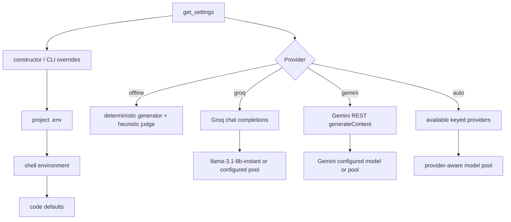

Live call budget:

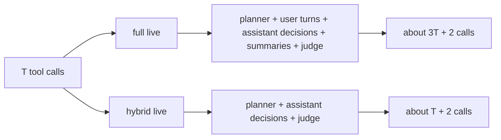

## Evaluation Strategy

Each conversation receives scores for:

- tool correctness
- naturalness
- task completion
- overall quality

The diversity experiment compares:

- Run A: steering disabled
- Run B: steering enabled

Metrics include:

- tool-combination entropy
- domain coverage coefficient of variation
- unique tool pairs
- mean quality score
- pattern distribution

These metrics are simple on purpose. They are easy to explain, easy to reproduce, and
show whether the generator is producing a balanced corpus rather than repeating one
successful chain.

Quality gate:

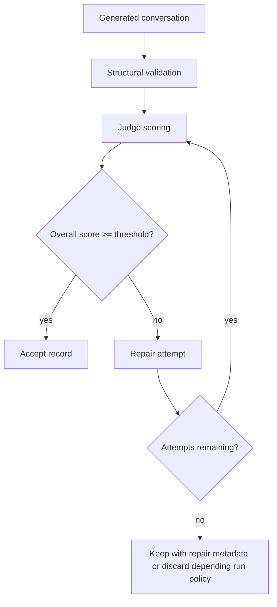

Diversity experiment:

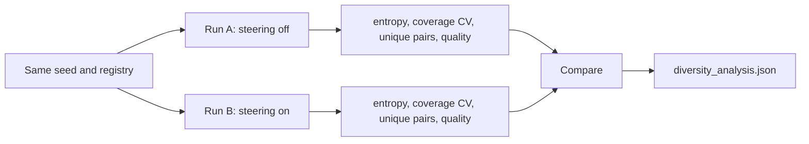

Dashboard trace model:

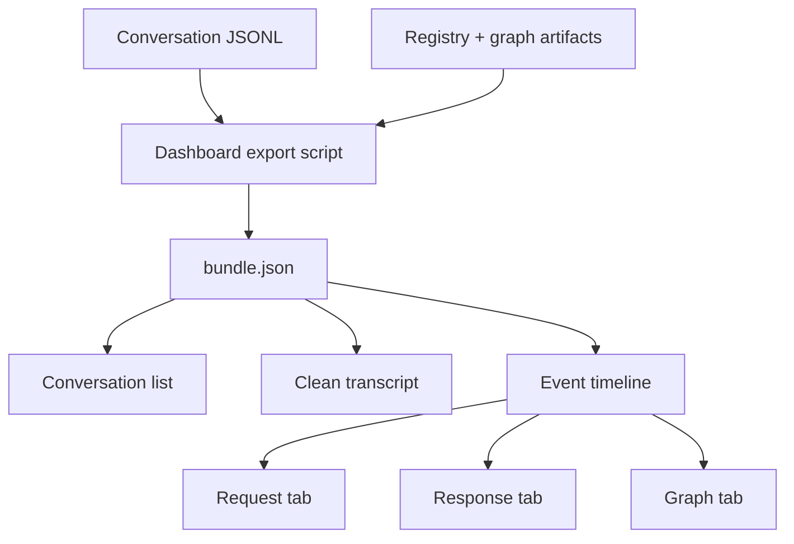

## Security And Reproducibility

- `.env` is read locally and ignored by git.
- Real API keys are not written to docs, output JSONL, dashboard bundles, or frontend
  source.
- Gemini keys are sent as request headers, not URL query parameters.
- Generated data, local ToolBench dumps, caches, and build outputs are ignored.
- Offline mode keeps tests stable without external services.
- Strict live mode is available when the assessment requires pure LLM generation.

## Known Limitations

- Offline text is structurally useful but less fluent than live LLM output.
- Full strict-live generation depends on provider quota and key health.
- Independent parallel tool calls in the same assistant turn are future work.
- Mock tool outputs do not fully simulate auth, pagination, failures, or side effects.
- The bundled fixture corpus is intentionally small; serious coverage claims require a
  larger ToolBench corpus.

## High-Impact Next Steps

1. Add semantic graph edges from endpoint-description embeddings.
2. Add a global coverage planner before generation starts.
3. Add domain-specific mock executors for travel, finance, shopping, and search.
4. Add failure-mode generation, such as unavailable records and invalid user inputs.
5. Add judge calibration with manually reviewed examples.
