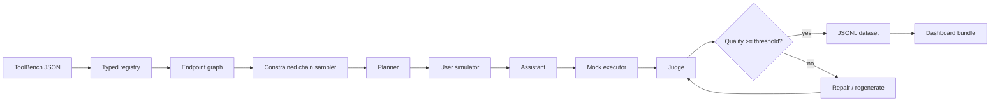
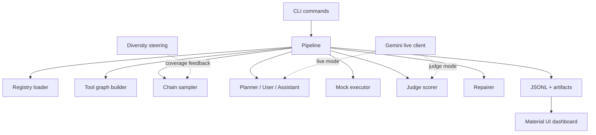
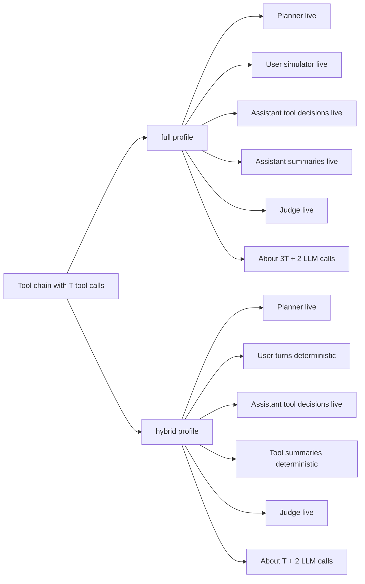
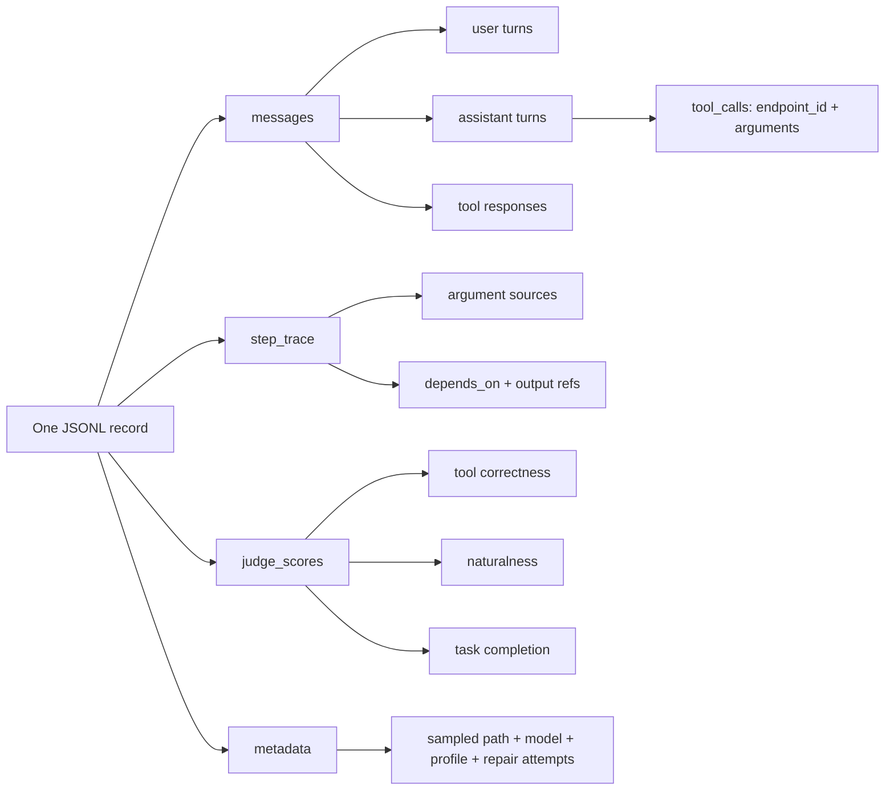
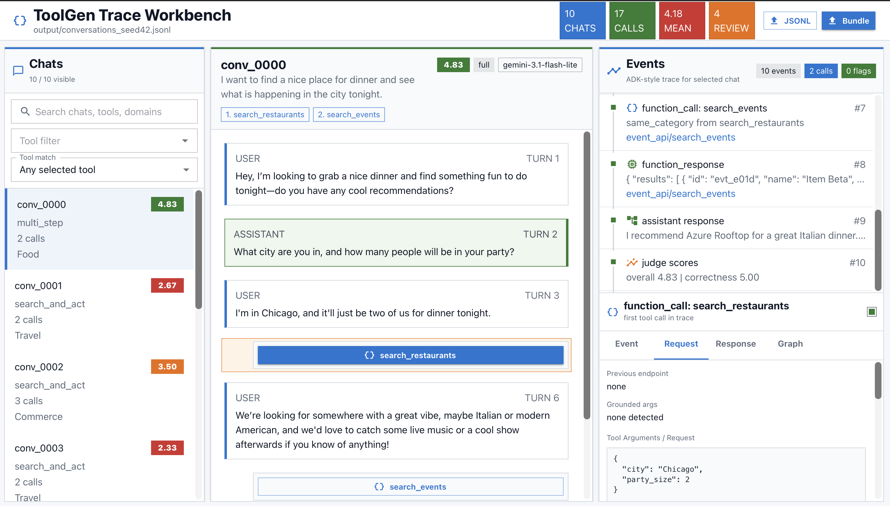
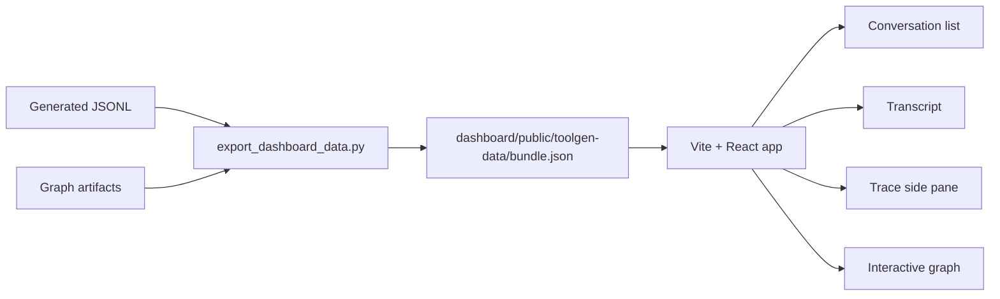

# ToolGen

Synthetic multi-tool conversations for training and evaluating agentic LLMs.

Think of it as a flight simulator for tool-using agents: it does
not call real APIs, but it creates realistic practice missions where the assistant must
choose tools, pass grounded arguments, use earlier tool outputs, and get scored.

## Why This Matters

Good tool-use data is hard to collect. Real API traces are private, inconsistent, and
expensive to label. ToolGen turns ToolBench-style schemas into auditable JSONL records:

- valid endpoint ids and argument shapes
- multi-step and multi-tool traces sampled from a tool graph
- fake but chain-consistent tool outputs
- clarifying questions when required fields are missing
- LLM-as-judge or heuristic quality scores
- repair metadata for failed or weak generations
- a Material UI dashboard for inspecting conversations and graph behavior

The result is not just "chat text". It is a structured corpus for debugging, training,
and evaluating agents that call tools.

## How It Works



Main code lives in `src/toolgen`:

- `registry/`: parses messy ToolBench-style API JSON into typed models
- `graph/`: builds endpoint relationships and weighted random-walk samplers
- `agents/`: planner, user simulator, assistant, and provider-aware LLM client
- `executor/`: schema-aware mock tool execution with ID chaining
- `judge/`: LLM-as-judge path plus deterministic fallback scoring
- `repair/`: structural repair and optional regeneration
- `pipeline.py`: end-to-end orchestration and diversity experiment logic

Runtime architecture:



## Quickstart

Run from the repository root:

```bash
python -m venv .venv
. .venv/bin/activate
pip install ".[dev]"

toolgen build
toolgen generate -n 100 --seed 42 -o output/conversations_seed42.jsonl
toolgen evaluate output/conversations_seed42.jsonl
toolgen analyze output/conversations_seed42.scored.jsonl
toolgen run-experiment -n 50 --seed 42
```

`generate`, `evaluate`, and `analyze` show Rich progress bars. Generation uses a compact
view by default: one main progress line plus one live row per active conversation. Pass
`--progress-log` only when you want the full event stream printed above the progress UI.
`build` writes JSON/JSONL artifacts and Markdown Mermaid companions under
`output/artifacts/` for quick visual inspection.

Useful checks:

```bash
.venv/bin/python -m pytest -q
.venv/bin/ruff check src tests scripts
cd dashboard && npm run build
```

## Live LLM Mode

ToolGen is runnable without credentials. For this submission, live generation is
configured around `gemini-3.1-flash-lite` only. The default live profile is `hybrid`,
which keeps planner, assistant tool-decision turns, and judge live while using
deterministic user turns and deterministic tool-result summaries to stay inside quota.

```bash
cp .env.example .env
# Set GEMINI_API_KEY in .env

export TOOLGEN_LLM_PROVIDER=gemini
export TOOLGEN_GENERATION_MODEL=gemini-3.1-flash-lite
export TOOLGEN_JUDGE_MODEL=gemini-3.1-flash-lite
export TOOLGEN_RANDOMIZE_MODELS=false
export TOOLGEN_LLM_REQUESTS_PER_MINUTE=10
export TOOLGEN_MAX_PARALLEL_CONVERSATIONS=2
export TOOLGEN_LLM_MAX_OUTPUT_TOKENS=256
toolgen generate -n 10 --seed 42 -o output/live_sample.jsonl
```

Quota-saving hybrid live mode is the default configured path:

```bash
export TOOLGEN_LIVE_PROFILE=hybrid
export TOOLGEN_LLM_PROVIDER=gemini
export TOOLGEN_GENERATION_MODEL=gemini-3.1-flash-lite
export TOOLGEN_JUDGE_MODEL=gemini-3.1-flash-lite
export TOOLGEN_RANDOMIZE_MODELS=false
export TOOLGEN_MAX_PARALLEL_CONVERSATIONS=2
export TOOLGEN_LLM_REQUESTS_PER_MINUTE=10
export TOOLGEN_LLM_MAX_OUTPUT_TOKENS=256
toolgen generate -n 100 --seed 42 --no-repair -o output/hybrid_live_100.jsonl
```

For strict full-live runs, fail instead of falling back:

```bash
export TOOLGEN_LIVE_PROFILE=full
export TOOLGEN_REQUIRE_LIVE_LLM=true
export TOOLGEN_LLM_REQUESTS_PER_MINUTE=10
toolgen generate -n 100 --seed 42 -o output/live_strict_100.jsonl
```

Live profile tradeoff:



Notes:

- Gemini keys are sent in the `x-goog-api-key` header, not as URL query parameters.
- Local CLI config precedence is: constructor/CLI overrides, then the project `.env`,
  then shell environment variables, then defaults. This prevents stale exported
  `TOOLGEN_*` values from silently overriding the project `.env`.
- Use `toolgen config` to inspect the resolved provider, model list, `.env` path, and
  key presence without printing secret values.
- Explicit `TOOLGEN_GENERATION_MODEL` and `TOOLGEN_JUDGE_MODEL` values are respected.
  The submission `.env` keeps randomization off so every live role uses
  `gemini-3.1-flash-lite`.
- Role-specific pools are still supported for experiments, but leave
  `TOOLGEN_PLANNER_MODEL_POOL`, `TOOLGEN_ASSISTANT_MODEL_POOL`,
  `TOOLGEN_USER_MODEL_POOL`, and `TOOLGEN_SUMMARY_MODEL_POOL` blank for the
  Gemini-only assessment run.
- `TOOLGEN_MAX_PARALLEL_CONVERSATIONS` runs multiple conversations concurrently. All
  workers share one rate limiter, so request starts remain bounded by
  `TOOLGEN_LLM_REQUESTS_PER_MINUTE`.
- During generation, the CLI progress bar includes `live_calls=N`, the number of live
  Gemini HTTP attempts started in the current run.
- `TOOLGEN_LLM_MAX_OUTPUT_TOKENS` caps each live response. `256` keeps outputs short;
  raise it toward `512` if planner or judge JSON ever gets truncated.
- `full` live mode costs about `3T + 2` LLM calls per chat for `T` tool calls.
- `hybrid` live mode costs about `T + 2` LLM calls per chat.
- A 100-record live run can require several hundred LLM calls because each record may
  use planner, user, assistant, judge, and repair calls. Quota limits are the main risk.

## Per-Chat Runtime Snapshot

On the bundled fixture corpus, a deterministic offline benchmark of 30 chats with one
worker and repair enabled finished in `0.033s` total, or about `0.001s/chat`. That path
does no network work; it mainly measures registry, graph sampling, mock execution,
heuristic judging, and JSONL serialization.

Average record shape from that run:

| Metric | Average |
| --- | ---: |
| Metadata turns/messages | 9.00 |
| Tool calls | 2.67 |
| Distinct tools | 1.57 |
| Multi-step + multi-tool share | 53.3% |
| Quality score | 4.75 / 5 |

Live LLM mode is different: wall-clock time is dominated by rate limiting and provider
latency. A useful estimate is:

```text
seconds_per_chat ~= (live_llm_calls_per_chat / TOOLGEN_LLM_REQUESTS_PER_MINUTE) * 60
```

Using the measured `2.67` average tool calls/chat:

| Live profile | Approx calls/chat | At 10 RPM |
| --- | ---: | ---: |
| `hybrid` | `T + 2` = about 4.67 | about 28s/chat |
| `full` | `3T + 2` = about 10.0 | about 60s/chat |

Parallel conversations overlap waiting time, but all workers share one rate limiter, so
they do not exceed the configured RPM. Repairs, retries, or a slower model can increase
the wall-clock time.

## Data

The bundled fixture corpus lives at:

```text
data/toolenv/tools/<Category>/<tool>.json
```

It is small by design so tests and demos are reproducible. To run on a larger local
ToolBench-style corpus:

```bash
export TOOLGEN_TOOLENV_DIR=/path/to/toolenv/tools
toolgen build --max-tools 100
toolgen generate -n 100 --seed 42 --max-tools 100 -o output/toolbench_sample.jsonl
```

To download a local ToolBench API-corpus slice without replacing the fixture data:

```bash
python scripts/download_toolbench.py --max-categories 3 --max-tools 100
export TOOLGEN_TOOLENV_DIR=.toolbench_tmp/toolenv/tools
```

Generated outputs are written under `output/` and are ignored by git.

## Output Format

Each JSONL record includes:

- `conversation_id`
- `messages` with `user`, `assistant`, and `tool` roles
- assistant `tool_calls` with endpoint ids and arguments
- tool messages with mock responses
- `step_trace` entries showing each tool step, dependencies, argument sources, and
  returned reference ids
- `judge_scores` for tool correctness, naturalness, task completion, and overall score
- `metadata` for seed, tools, domains, pattern, LLM mode, model names, repair attempts,
  generation profile, and planner scenario

Record anatomy:



## Dashboard

 

The dashboard is a React/Vite + Material UI app in `dashboard/`. It is now a single
trace workbench: generated chats scroll on the left, the selected chat appears in the
center, and an ADK-style Events pane on the right shows tool calls, mock responses,
trace-first reasoning, judge output, repair flags, and the sampled tool path.

```bash
.venv/bin/python scripts/export_dashboard_data.py \
  --dataset output/conversations_seed42.jsonl

cd dashboard
npm install
npm run dev
```

Open `http://127.0.0.1:5173`.

Workbench layout:

- left pane: scrollable generated chats with search and tool filters
- center pane: clean user/assistant transcript with clickable tool-call chips
- right pane: Events timeline plus Event, Request, Response, and Graph detail tabs;
  tool-call requests include the `step_trace` argument-source audit

Dashboard data path:



## What Is Covered

- ToolBench-style ingestion and normalization
- endpoint graph construction
- constrained graph sampling
- multi-agent conversation generation
- trace-first reasoning metadata for tool dependencies and argument provenance
- offline mock execution with within-conversation grounding
- cross-conversation diversity steering
- LLM-as-judge scoring and fallback scoring
- repair and retry loop
- CLI package, tests, dashboard, and design docs

## Honest Limitations

- Offline language is template-based; it is best for structure, not final fluency.
- Strict live runs depend on provider quota and key health.
- Parallel independent tool calls in a single assistant turn are not implemented.
- Mock APIs do not simulate auth, pagination, real failures, or external side effects.
- The bundled fixture corpus is small; use a larger ToolBench corpus for serious
  diversity claims.
