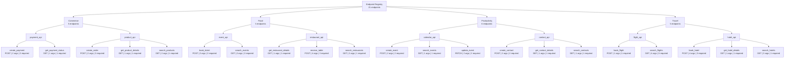

# Endpoints Diagram

Source artifact: `endpoints.jsonl`

```mermaid
flowchart TB
  R["Endpoint Registry<br/>21 endpoints"]
  R --> C0["Commerce<br/>5 endpoints"]
  C0 --> T0["payment_api"]
  T0 --> E4["create_payment<br/>POST | 2 args | 2 required"]
  T0 --> E5["get_payment_status<br/>GET | 1 args | 1 required"]
  C0 --> T1["product_api"]
  T1 --> E7["create_order<br/>POST | 2 args | 2 required"]
  T1 --> E8["get_product_details<br/>GET | 1 args | 1 required"]
  T1 --> E9["search_products<br/>GET | 2 args | 1 required"]
  R --> C1["Food<br/>5 endpoints"]
  C1 --> T2["event_api"]
  T2 --> E12["book_ticket<br/>POST | 2 args | 2 required"]
  T2 --> E13["search_events<br/>GET | 2 args | 2 required"]
  C1 --> T3["restaurant_api"]
  T3 --> E15["get_restaurant_details<br/>GET | 1 args | 1 required"]
  T3 --> E16["reserve_table<br/>POST | 4 args | 3 required"]
  T3 --> E17["search_restaurants<br/>GET | 2 args | 1 required"]
  R --> C2["Productivity<br/>6 endpoints"]
  C2 --> T4["calendar_api"]
  T4 --> E20["create_event<br/>POST | 2 args | 2 required"]
  T4 --> E21["search_events<br/>GET | 1 args | 1 required"]
  T4 --> E22["update_event<br/>PATCH | 2 args | 2 required"]
  C2 --> T5["contact_api"]
  T5 --> E24["create_contact<br/>POST | 2 args | 2 required"]
  T5 --> E25["get_contact_details<br/>GET | 1 args | 1 required"]
  T5 --> E26["search_contacts<br/>GET | 1 args | 1 required"]
  R --> C3["Travel<br/>5 endpoints"]
  C3 --> T6["flight_api"]
  T6 --> E29["book_flight<br/>POST | 1 args | 1 required"]
  T6 --> E30["search_flights<br/>GET | 4 args | 3 required"]
  C3 --> T7["hotel_api"]
  T7 --> E32["book_hotel<br/>POST | 4 args | 3 required"]
  T7 --> E33["get_hotel_details<br/>GET | 1 args | 1 required"]
  T7 --> E34["search_hotels<br/>GET | 3 args | 1 required"]
```
