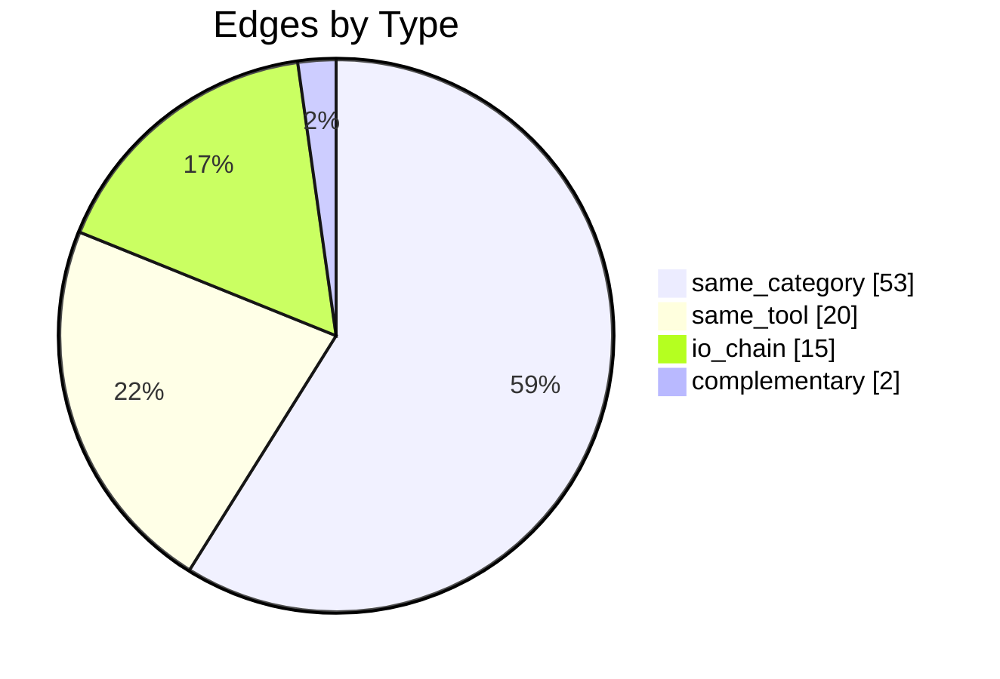

# Graph Edges Diagram

Source artifact: `graph_edges.jsonl`

```mermaid
flowchart LR
  N0["calendar_api/create_event"]
  N1["calendar_api/update_event"]
  N0 -->|io_chain 1.0| N1
  N2["calendar_api/search_events"]
  N1["calendar_api/update_event"]
  N2 -->|io_chain 1.0| N1
  N3["contact_api/create_contact"]
  N4["contact_api/get_contact_details"]
  N3 -->|io_chain 1.0| N4
  N5["contact_api/search_contacts"]
  N4["contact_api/get_contact_details"]
  N5 -->|io_chain 1.0| N4
  N6["event_api/search_events"]
  N7["event_api/book_ticket"]
  N6 -->|io_chain 1.0| N7
  N8["flight_api/search_flights"]
  N9["flight_api/book_flight"]
  N8 -->|io_chain 1.0| N9
  N10["hotel_api/book_hotel"]
  N11["hotel_api/get_hotel_details"]
  N10 -->|io_chain 1.0| N11
  N12["hotel_api/search_hotels"]
  N10["hotel_api/book_hotel"]
  N12 -->|io_chain 1.0| N10
  N12["hotel_api/search_hotels"]
  N11["hotel_api/get_hotel_details"]
  N12 -->|io_chain 1.0| N11
  N13["payment_api/create_payment"]
  N14["payment_api/get_payment_status"]
  N13 -->|io_chain 1.0| N14
  N15["product_api/create_order"]
  N13["payment_api/create_payment"]
  N15 -->|io_chain 1.0| N13
  N16["product_api/search_products"]
  N15["product_api/create_order"]
  N16 -->|io_chain 1.0| N15
  N16["product_api/search_products"]
  N17["product_api/get_product_details"]
  N16 -->|io_chain 1.0| N17
  N18["restaurant_api/search_restaurants"]
  N19["restaurant_api/get_restaurant_details"]
  N18 -->|io_chain 1.0| N19
  N18["restaurant_api/search_restaurants"]
  N20["restaurant_api/reserve_table"]
  N18 -->|io_chain 1.0| N20
  N2["calendar_api/search_events"]
  N0["calendar_api/create_event"]
  N2 -->|complementary 0.8| N0
  N5["contact_api/search_contacts"]
  N3["contact_api/create_contact"]
  N5 -->|complementary 0.8| N3
  N0["calendar_api/create_event"]
  N2["calendar_api/search_events"]
  N0 -->|same_tool 0.3| N2
  N1["calendar_api/update_event"]
  N0["calendar_api/create_event"]
  N1 -->|same_tool 0.3| N0
  N1["calendar_api/update_event"]
  N2["calendar_api/search_events"]
  N1 -->|same_tool 0.3| N2
  N3["contact_api/create_contact"]
  N5["contact_api/search_contacts"]
  N3 -->|same_tool 0.3| N5
  N4["contact_api/get_contact_details"]
  N3["contact_api/create_contact"]
  N4 -->|same_tool 0.3| N3
  N4["contact_api/get_contact_details"]
  N5["contact_api/search_contacts"]
  N4 -->|same_tool 0.3| N5
  N7["event_api/book_ticket"]
  N6["event_api/search_events"]
  N7 -->|same_tool 0.3| N6
  N9["flight_api/book_flight"]
  N8["flight_api/search_flights"]
  N9 -->|same_tool 0.3| N8
  N10["hotel_api/book_hotel"]
  N12["hotel_api/search_hotels"]
  N10 -->|same_tool 0.3| N12
  N11["hotel_api/get_hotel_details"]
  N10["hotel_api/book_hotel"]
  N11 -->|same_tool 0.3| N10
  N11["hotel_api/get_hotel_details"]
  N12["hotel_api/search_hotels"]
  N11 -->|same_tool 0.3| N12
  N14["payment_api/get_payment_status"]
  N13["payment_api/create_payment"]
  N14 -->|same_tool 0.3| N13
  N15["product_api/create_order"]
  N17["product_api/get_product_details"]
  N15 -->|same_tool 0.3| N17
  N15["product_api/create_order"]
  N16["product_api/search_products"]
  N15 -->|same_tool 0.3| N16
  N17["product_api/get_product_details"]
  N15["product_api/create_order"]
  N17 -->|same_tool 0.3| N15
  N17["product_api/get_product_details"]
  N16["product_api/search_products"]
  N17 -->|same_tool 0.3| N16
  N19["restaurant_api/get_restaurant_details"]
  N20["restaurant_api/reserve_table"]
  N19 -->|same_tool 0.3| N20
  N19["restaurant_api/get_restaurant_details"]
  N18["restaurant_api/search_restaurants"]
  N19 -->|same_tool 0.3| N18
  N20["restaurant_api/reserve_table"]
  N19["restaurant_api/get_restaurant_details"]
  N20 -->|same_tool 0.3| N19
  N20["restaurant_api/reserve_table"]
  N18["restaurant_api/search_restaurants"]
  N20 -->|same_tool 0.3| N18
  N0["calendar_api/create_event"]
  N3["contact_api/create_contact"]
  N0 -->|same_category 0.5| N3
  N0["calendar_api/create_event"]
  N4["contact_api/get_contact_details"]
  N0 -->|same_category 0.5| N4
  N0["calendar_api/create_event"]
  N5["contact_api/search_contacts"]
  N0 -->|same_category 0.5| N5
  N2["calendar_api/search_events"]
  N3["contact_api/create_contact"]
  N2 -->|same_category 0.5| N3
  N2["calendar_api/search_events"]
  N4["contact_api/get_contact_details"]
  N2 -->|same_category 0.5| N4
  N2["calendar_api/search_events"]
  N5["contact_api/search_contacts"]
  N2 -->|same_category 0.5| N5
  N1["calendar_api/update_event"]
  N3["contact_api/create_contact"]
  N1 -->|same_category 0.5| N3
  N1["calendar_api/update_event"]
  N4["contact_api/get_contact_details"]
  N1 -->|same_category 0.5| N4
  N1["calendar_api/update_event"]
  N5["contact_api/search_contacts"]
  N1 -->|same_category 0.5| N5
  N3["contact_api/create_contact"]
  N0["calendar_api/create_event"]
  N3 -->|same_category 0.5| N0
  N3["contact_api/create_contact"]
  N2["calendar_api/search_events"]
  N3 -->|same_category 0.5| N2
  N3["contact_api/create_contact"]
  N1["calendar_api/update_event"]
  N3 -->|same_category 0.5| N1
  N4["contact_api/get_contact_details"]
  N0["calendar_api/create_event"]
  N4 -->|same_category 0.5| N0
  N4["contact_api/get_contact_details"]
  N2["calendar_api/search_events"]
  N4 -->|same_category 0.5| N2
  N4["contact_api/get_contact_details"]
  N1["calendar_api/update_event"]
  N4 -->|same_category 0.5| N1
  N5["contact_api/search_contacts"]
  N0["calendar_api/create_event"]
  N5 -->|same_category 0.5| N0
  N5["contact_api/search_contacts"]
  N2["calendar_api/search_events"]
  N5 -->|same_category 0.5| N2
  N5["contact_api/search_contacts"]
  N1["calendar_api/update_event"]
  N5 -->|same_category 0.5| N1
  N7["event_api/book_ticket"]
  N19["restaurant_api/get_restaurant_details"]
  N7 -->|same_category 0.5| N19
  N7["event_api/book_ticket"]
  N20["restaurant_api/reserve_table"]
  N7 -->|same_category 0.5| N20
  N7["event_api/book_ticket"]
  N18["restaurant_api/search_restaurants"]
  N7 -->|same_category 0.5| N18
  N6["event_api/search_events"]
  N19["restaurant_api/get_restaurant_details"]
  N6 -->|same_category 0.5| N19
  N6["event_api/search_events"]
  N20["restaurant_api/reserve_table"]
  N6 -->|same_category 0.5| N20
  N6["event_api/search_events"]
  N18["restaurant_api/search_restaurants"]
  N6 -->|same_category 0.5| N18
  N9["flight_api/book_flight"]
  N10["hotel_api/book_hotel"]
  N9 -->|same_category 0.5| N10
  N9["flight_api/book_flight"]
  N11["hotel_api/get_hotel_details"]
  N9 -->|same_category 0.5| N11
  N9["flight_api/book_flight"]
  N12["hotel_api/search_hotels"]
  N9 -->|same_category 0.5| N12
  N8["flight_api/search_flights"]
  N10["hotel_api/book_hotel"]
  N8 -->|same_category 0.5| N10
  N8["flight_api/search_flights"]
  N11["hotel_api/get_hotel_details"]
  N8 -->|same_category 0.5| N11
  N8["flight_api/search_flights"]
  N12["hotel_api/search_hotels"]
  N8 -->|same_category 0.5| N12
  N10["hotel_api/book_hotel"]
  N9["flight_api/book_flight"]
  N10 -->|same_category 0.5| N9
  N10["hotel_api/book_hotel"]
  N8["flight_api/search_flights"]
  N10 -->|same_category 0.5| N8
  N11["hotel_api/get_hotel_details"]
  N9["flight_api/book_flight"]
  N11 -->|same_category 0.5| N9
  N11["hotel_api/get_hotel_details"]
  N8["flight_api/search_flights"]
  N11 -->|same_category 0.5| N8
  N12["hotel_api/search_hotels"]
  N9["flight_api/book_flight"]
  N12 -->|same_category 0.5| N9
  N12["hotel_api/search_hotels"]
  N8["flight_api/search_flights"]
  N12 -->|same_category 0.5| N8
  N13["payment_api/create_payment"]
  N15["product_api/create_order"]
  N13 -->|same_category 0.5| N15
  N13["payment_api/create_payment"]
  N17["product_api/get_product_details"]
  N13 -->|same_category 0.5| N17
  N13["payment_api/create_payment"]
  N16["product_api/search_products"]
  N13 -->|same_category 0.5| N16
  N14["payment_api/get_payment_status"]
  N15["product_api/create_order"]
  N14 -->|same_category 0.5| N15
  N14["payment_api/get_payment_status"]
  N17["product_api/get_product_details"]
  N14 -->|same_category 0.5| N17
  N14["payment_api/get_payment_status"]
  N16["product_api/search_products"]
  N14 -->|same_category 0.5| N16
  N15["product_api/create_order"]
  N14["payment_api/get_payment_status"]
  N15 -->|same_category 0.5| N14
  N17["product_api/get_product_details"]
  N13["payment_api/create_payment"]
  N17 -->|same_category 0.5| N13
  N17["product_api/get_product_details"]
  N14["payment_api/get_payment_status"]
  N17 -->|same_category 0.5| N14
  N16["product_api/search_products"]
  N13["payment_api/create_payment"]
  N16 -->|same_category 0.5| N13
  N16["product_api/search_products"]
  N14["payment_api/get_payment_status"]
  N16 -->|same_category 0.5| N14
  N19["restaurant_api/get_restaurant_details"]
  N7["event_api/book_ticket"]
  N19 -->|same_category 0.5| N7
  N19["restaurant_api/get_restaurant_details"]
  N6["event_api/search_events"]
  N19 -->|same_category 0.5| N6
  N20["restaurant_api/reserve_table"]
  N7["event_api/book_ticket"]
  N20 -->|same_category 0.5| N7
  N20["restaurant_api/reserve_table"]
  N6["event_api/search_events"]
  N20 -->|same_category 0.5| N6
  N18["restaurant_api/search_restaurants"]
  N7["event_api/book_ticket"]
  N18 -->|same_category 0.5| N7
  N18["restaurant_api/search_restaurants"]
  N6["event_api/search_events"]
  N18 -->|same_category 0.5| N6
```

```mermaid
pie showData
  title Edges by Type
  "same_category" : 53
  "same_tool" : 20
  "io_chain" : 15
  "complementary" : 2
```
