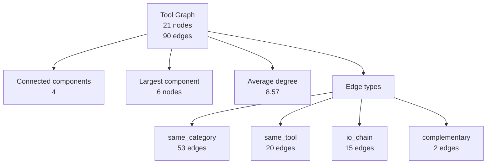
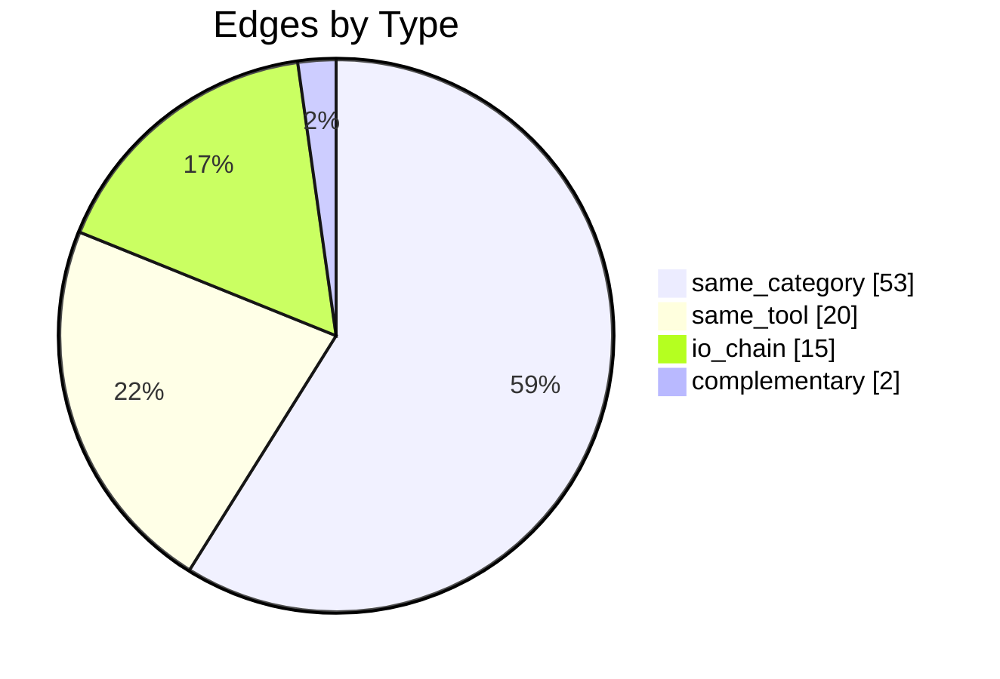

# Graph Stats Diagram

Source artifact: `graph_stats.json`

```mermaid
flowchart TB
  G["Tool Graph<br/>21 nodes<br/>90 edges"]
  G --> C["Connected components<br/>4"]
  G --> L["Largest component<br/>6 nodes"]
  G --> D["Average degree<br/>8.57"]
  G --> E["Edge types"]
  E --> ET0["same_category<br/>53 edges"]
  E --> ET1["same_tool<br/>20 edges"]
  E --> ET2["io_chain<br/>15 edges"]
  E --> ET3["complementary<br/>2 edges"]
```

```mermaid
pie showData
  title Edges by Type
  "same_category" : 53
  "same_tool" : 20
  "io_chain" : 15
  "complementary" : 2
```
