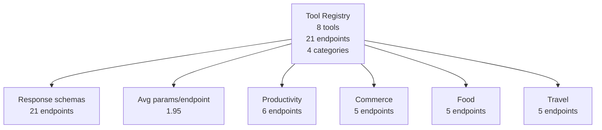
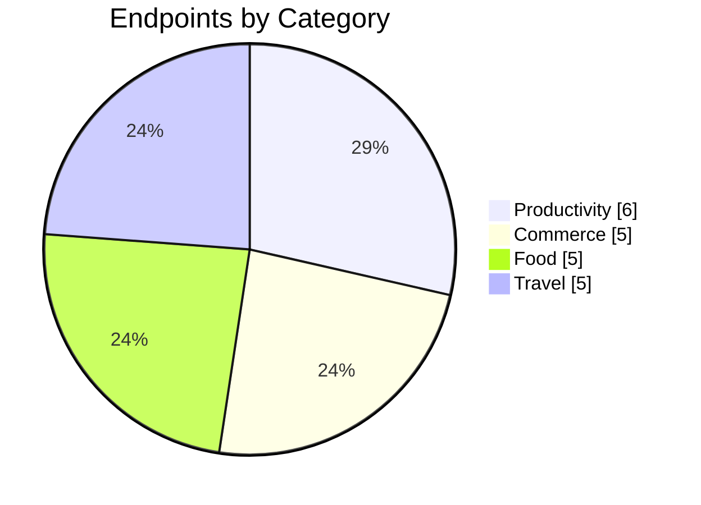

# Registry Stats Diagram

Source artifact: `registry_stats.json`

```mermaid
flowchart TB
  R["Tool Registry<br/>8 tools<br/>21 endpoints<br/>4 categories"]
  R --> S["Response schemas<br/>21 endpoints"]
  R --> P["Avg params/endpoint<br/>1.95"]
  R --> C0["Productivity<br/>6 endpoints"]
  R --> C1["Commerce<br/>5 endpoints"]
  R --> C2["Food<br/>5 endpoints"]
  R --> C3["Travel<br/>5 endpoints"]
```

```mermaid
pie showData
  title Endpoints by Category
  "Productivity" : 6
  "Commerce" : 5
  "Food" : 5
  "Travel" : 5
```
